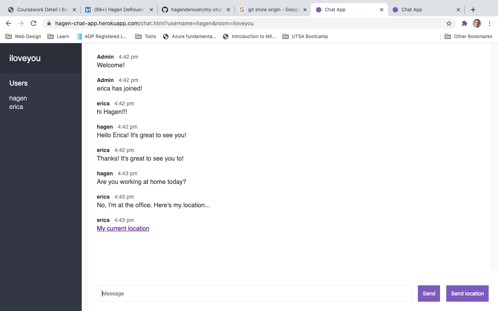

# my-chat-app
Join a private room and send messages in real-time. Share your location on Google Maps.

The app was built using the [WebSocket](https://developer.mozilla.org/en-US/docs/Web/API/WebSockets_API/Writing_WebSocket_servers) protocol with [Node](https://nodejs.org/) and [Express](https://expressjs.com/). 

[View Live](https://hagen-chat-app.herokuapp.com/)

Special thanks to [Andrew Mead](https://www.udemy.com/user/andrewmead/)